# Player 1 Inventory

**Track what you have. Shop what you need. Cook what you can.**

A household pantry manager: track stock levels, build shopping lists, and log ingredient use when cooking. Offline-first, so it works in a supermarket aisle with no signal. Cloud-optional, so a household can share one pantry.

**[▶ Live app](https://player1inventory.etblue.tw)** · [Design guide](https://design.player1inventory.etblue.tw) · [Storybook](https://storybook.player1inventory.etblue.tw) · [Design docs](docs/INDEX.md)

> I use this daily, on laptop and phone, to run my own household pantry. Every design decision below came from hitting a real problem while using it.


## At a glance

| Product decisions | Engineering |
| --- | --- |
| [Six real-world design problems](#design-challenges), each written up as problem → decision → rationale | [One component tree, two data sources](#under-the-hood) — IndexedDB offline, GraphQL in the cloud, switched by a flag |
| [Cold-start onboarding](#challenge-5-efforts-of-initial-pantry-setup) that seeds a usable pantry without asking a first-time user to design a taxonomy | [OKLCH design tokens](#challenge-6-accessibility-of-color-semantics-across-light-and-dark-themes) where WCAG AA contrast holds by construction, not by spot-checking |
| [User-defined categorization](#challenge-3-practicality-of-pantry-item-categorization) instead of an enforced, exhaustive category tree | Four test layers: Vitest units, Storybook smoke tests, Playwright E2E, and an axe WCAG AA scan on every branch |
| [Bidirectional entity creation](#challenge-4-bidirectionality-of-item-and-entity-management), so a user working from a tag never navigates back just to add an item | [~40 in-repo design docs](docs/INDEX.md) — brainstorm → design → plan → implement, with the reasoning kept |

## Features

### Track what you have

Every item tracks packed and unpacked quantities separately — opened packages and untouched ones are different states that matter for consumption order. A segmented progress bar shows both at a glance, color-coded by stock status (in stock / low / out of stock).

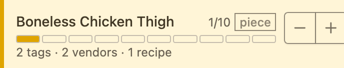

Items with variable package sizes (e.g. milk in 1000ml or 2000ml cartons) can be tracked in measurement units instead of package counts. Expiration is configurable per item: set a fixed due date, or let the app calculate it from the last purchase date.

<details>
<summary>More: stock states, measurement tracking, expiration modes</summary>

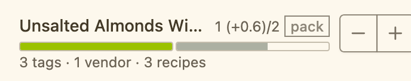
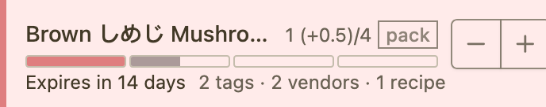

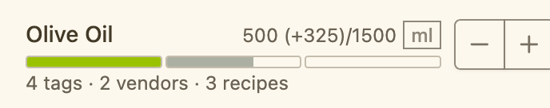

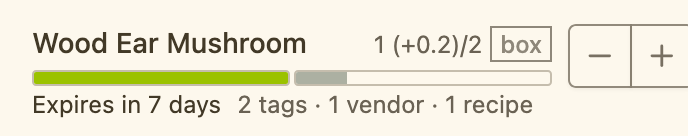
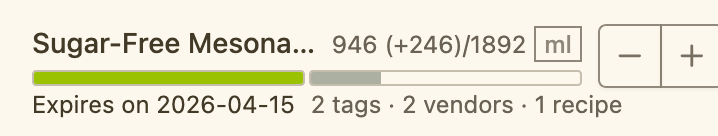

</details>

### Shop what you need

Each item has a configurable refill threshold. The shopping page sorts by stock level by default, so low-stock items rise to the top automatically. The list filters by vendor, so each household member sees only what to pick up at their store.

With cloud sync enabled, anyone in the household can check what's running low on their way to the store — no real-time coordination needed.


### Cook what you can

Recipes group ingredients with default consumption amounts. When cooking, the app pre-fills quantities from the recipe — follow them or adjust on the fly. Ingredients with a default amount of `0` are optional and start unchecked.

Cooking a recipe deducts every ingredient in one step, with the option to set servings and override individual amounts before confirming.


## Design Challenges

Real-life household goods have messier state transitions, looser categorization, and more overlapping relationships than a game inventory does. These are the six problems I ran into while using the app, and what I decided to do about each.

### Challenge 1: Complexity of real-life asset state transitions

A pantry item isn't just "in stock" or "out of stock." It moves through several states, each demanding its own design decision.

**Stocking threshold** — users carry an implicit sense of "enough" in their heads. Making it explicit (target quantity + refill threshold) lets the shopping page sort low-stock items to the top automatically, and gives them a distinct color in list views.

**Variable package sizes** — milk might come in 1000ml or 2000ml cartons, so tracking by package count loses precision. A dual unit system (package + measurement) lets users track in whichever unit makes sense for that item.

**Packed vs. unpacked** — opened goods expire sooner than sealed ones, and users need to see both at once. The two quantities are stored separately, and the segmented progress bar encodes both states in a single visual.

**Partial consumption** — using 200ml of milk shouldn't require typing arithmetic or pressing minus 200 times. A configurable "amount per consumption" becomes the step size for every ± button across the pantry, cooking, and recipe pages.

**Expiration** — some items have printed dates (milk), some don't (mushrooms), some never expire (batteries). Two modes cover this: a fixed due date, or a number of days counted from the last purchase. A warning threshold raises a badge as an item nears expiry.

<details>
<summary>Screenshots: threshold, units, quantity bar, consumption amount, expiration</summary>

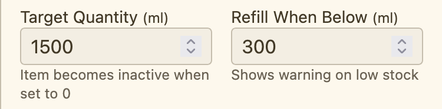
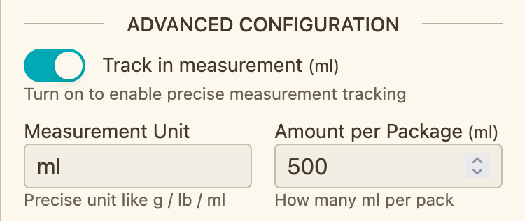

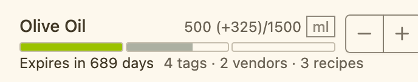
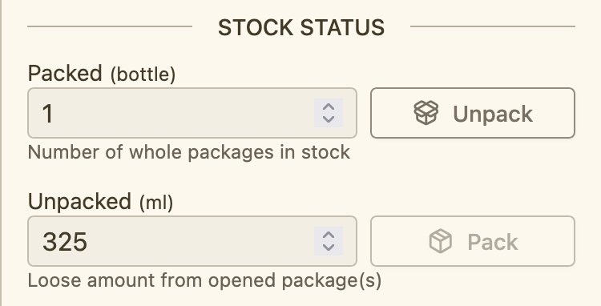

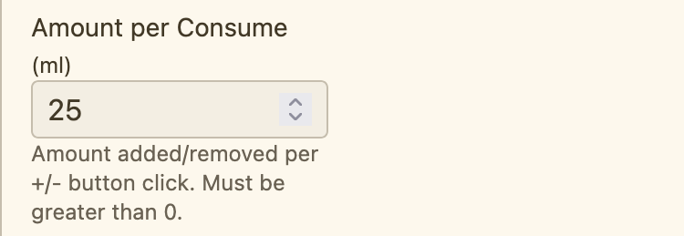

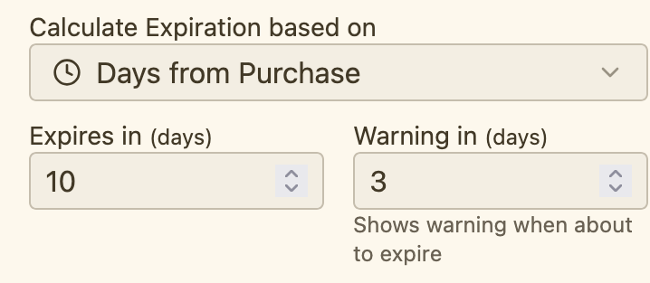
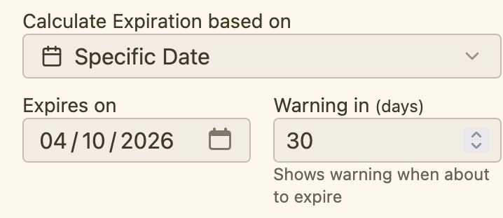

</details>

### Challenge 2: Flexibility of cooking/consumption scenarios in real life

Simple household goods (toilet paper, toothpaste) just decrement. Ingredients don't: several are consumed together in varying combinations, and the same dish uses more or less of an ingredient each time — or skips one entirely.

Recipes group ingredients with a default consumption amount each. Optional or rarely-used ingredients get a default of 0, so the user opts them in per session. While cooking, users follow the defaults or adjust per-session amounts before confirming. **Recipes are a starting point, not a contract** — that framing is what kept the feature from turning into rigid meal-planning software.

### Challenge 3: Practicality of pantry item categorization

Real-world items can be classified along many axes — preservation method, nutritional category, origin, intended use. A fully exhaustive, mutually-exclusive taxonomy is accurate but impractical for daily pantry use, and nobody wants to design one before buying groceries.

The tag system lets users define their own classification axes (tag types) and nest tags within them. Nothing is enforced — users can be as rigorous or as casual as they like. Onboarding seeds two tag types, **Category** and **Preservation**, as a practical starting point.


### Challenge 4: Bidirectionality of item and entity management

Items, tags, vendors, and recipes form a many-to-many graph. Someone building their item list from a vendor's perspective shouldn't have to navigate back to the pantry just to create an item.

So creation works in both directions. From an item's page, users create tags, vendors, or recipes inline. From a tag, vendor, or recipe's items tab, the search bar doubles as a creation path: typing a name that matches nothing reveals a "+ Create" row. The pantry stays the primary entry point; the secondary path removes a navigation round-trip when working from a categorization angle.

<details>
<summary>Screenshots: inline creation from both directions</summary>


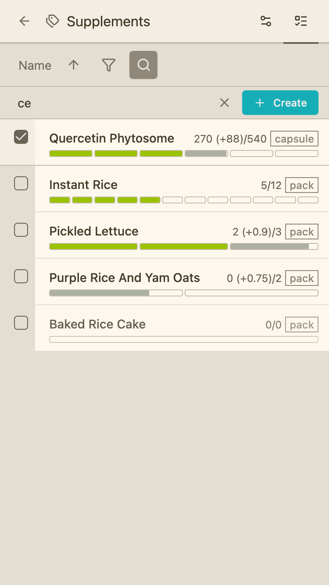


</details>

### Challenge 5: Efforts of initial pantry setup

Useful pantry tracking needs a lot of data up front: item names, package units, quantities, refill thresholds, tags, vendors. For a first-time user that's overwhelming — especially before they understand what any field does or what it buys them.

Onboarding offers a curated template: 20 common pantry items and 19 vendors to pick from. Tags ship silently as pre-configured metadata — useful, but too abstract to ask a first-timer to set up. Recipes are omitted entirely: cooking is optional, and a "general" recipe doesn't exist at household level, so a template would be either too narrow or too broad to help.

<details>
<summary>Screenshots: onboarding flow</summary>


</details>

### Challenge 6: Accessibility of color semantics across light and dark themes

The app expresses several color meanings at once — stock status, importance levels, tag categories — and has to meet WCAG AA contrast in both light and dark themes.

The token system uses two groups: low-saturation colors for baseline UI (backgrounds, text, borders) and saturated ones for highlights (buttons, badges, status bars). Each group covers three scenarios — readable content, visual decoration, and containers — encoded in the naming: `*-foreground` for text, `*-accessory` for decorations, no suffix for containers.

HSL lightness doesn't track perceptual luminance, which makes WCAG compliance impossible to reason about by inspection. So every token is defined in **OKLCH**, where the L channel *is* perceived lightness. Colors sharing a usage scenario are locked to the same L value (±5%) across both themes, which makes contrast ratios a property of the system rather than something to re-verify by hand after each change.

<details>
<summary>Screenshots: theme and color tokens</summary>

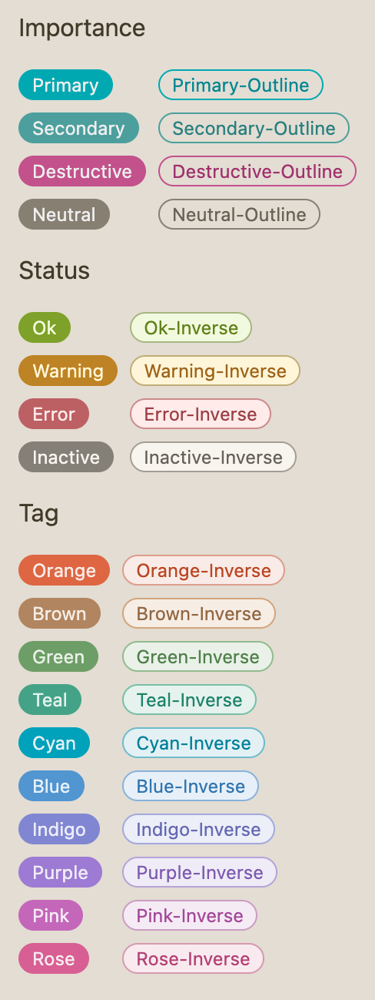
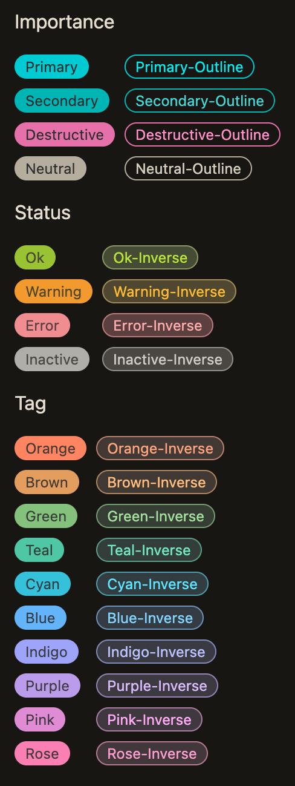


</details>

## Under the Hood

**Architecture**
- Offline-first with IndexedDB (Dexie.js), plus an optional GraphQL backend (PostgreSQL via Prisma, Apollo Server, Clerk auth) — the same component tree and hooks serve both modes; an `enabled` flag switches the active data source
- Components never touch the database directly; all data flows through TanStack Query hooks
- Monorepo (`apps/web` + `apps/server` + `apps/design` + `packages/types`) with TypeScript types shared across frontend and backend
- GraphQL types and React Apollo hooks generated by `graphql-codegen`, so the frontend can't drift from the schema

**Design system**
- Semantic color tokens authored directly in OKLCH — no separate primitive layer, plus a thin domain alias layer for inventory states (low-stock, expiring, in-stock, out-of-stock)
- Two-level token naming: scenario (`foreground` / `accessory` / container) × semantic group (`importance-*` / `status-*` / `hue-*`)
- Dark/light/system theme with no flash on load (inline init script ahead of React); system preference tracked, manual override persisted
- Published as a [public design guide](https://design.player1inventory.etblue.tw) (Astro + Starlight) alongside a [live Storybook](https://storybook.player1inventory.etblue.tw)

**Internationalization**
- react-i18next with English and Traditional Chinese locales
- An automated parity test fails the build if a key exists in one locale but not the other

**Testing**
- Unit + integration: Vitest and React Testing Library, using "user can …" naming with Given-When-Then comments
- Storybook smoke tests: every `.stories.tsx` has a matching `.stories.test.tsx` via `composeStories`, catching story regressions without manual review
- E2E: Playwright across all major pages and flows, in both offline and cloud modes
- Accessibility: 37 Biome a11y lint rules at write time, plus an axe-playwright WCAG AA scan (light, dark, and mobile viewports) on every branch

**Quality assurance**
- Pre-commit hook: Biome format and lint on staged files
- Pre-push hook: typecheck, lint, and the full test suite — AI-written code passes the same gates as hand-written code
- AI-assisted development with a design-first process: brainstorm → design doc → implementation plan → execution, one fresh subagent per task, with spec and code-review gates. The [design docs](docs/INDEX.md) are all kept in-repo.

## Stack

**Frontend** — React 19 · TypeScript · Vite · TanStack Router · TanStack Query · Dexie.js (IndexedDB) · Apollo Client · Tailwind CSS v4 · shadcn/ui · react-i18next

**Backend** — Apollo Server · Express · GraphQL · Prisma · PostgreSQL (Neon) · Clerk

**Tooling & quality** — Biome · Vitest · React Testing Library · Playwright · axe-playwright · Storybook · Astro/Starlight · graphql-codegen · Husky

**Deployment** — Cloudflare Pages (web, design guide, Storybook) · Railway (API) · Neon (database)

## Getting Started

```bash
pnpm install
pnpm dev    # runs graphql-codegen --watch, the Vite dev server, and the API server together
# open http://localhost:5173
```

Offline mode needs no backend at all — the app stores everything in IndexedDB and is fully usable on first run. Cloud sync additionally requires a PostgreSQL database and Clerk credentials; see `apps/server/.env.example`.

```bash
pnpm test         # Vitest
pnpm test:e2e     # Playwright
pnpm storybook    # component workshop
pnpm design       # design guide
```

---

The name is a real-life counterpart to [Guild Wars 2 Inventory](https://github.com/ETBlue/gw2inventory), a game inventory tool I built earlier. Both track assets you own. Real-life assets are messier — which is what made this one interesting to design.
